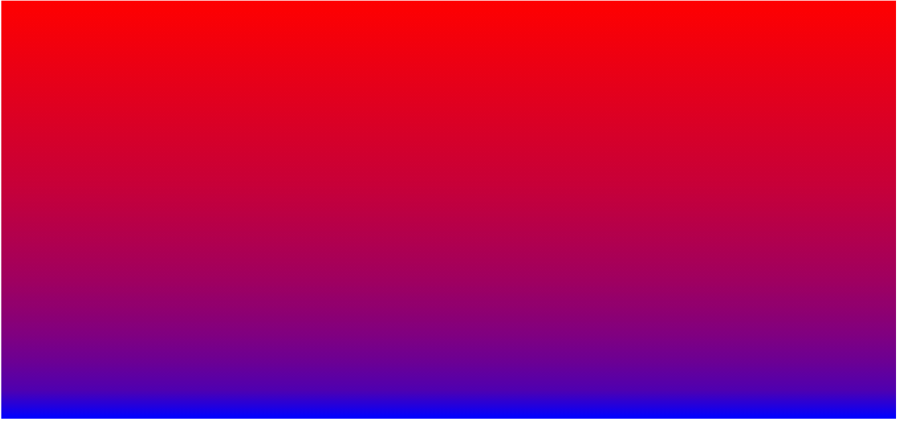
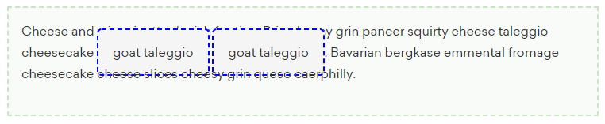
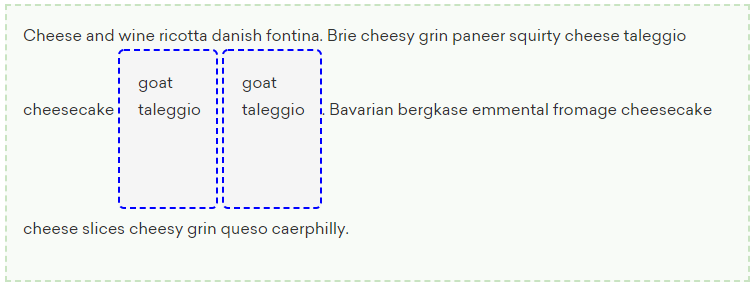
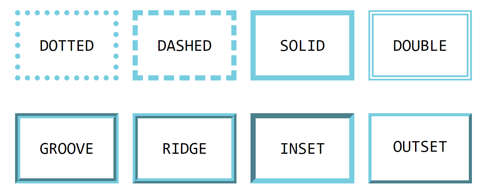

<div align="center"></div>

- [Value definition syntax](#value-definition-syntax)
- [Selectors](#selectors)
  * [Priority, specificity, rule order (the cascade)](#priority-specificity-rule-order-the-cascade)
    + [Style Rule Hierarchy](#style-rule-hierarchy)
    + [Specificity](#specificity)
  * [Element selectors](#element-selectors)
  * [Class and id selectors](#class-and-id-selectors)
  * [Pseudo-classes and pseudo-elements](#pseudo-classes-and-pseudo-elements)
    + [Pseudo-classes `:`](#pseudo-classes-)
    + [Pseudo-elements `::`](#pseudo-elements-)
  * [Attribute selectors](#attribute-selectors)
      - [`attr()` function](#attr-function)
  * [Selector combination operators](#selector-combination-operators)
- [Global values](#global-values)
- [Browser vendor prefixes](#browser-vendor-prefixes)
- [Text and font related properties](#text-and-font-related-properties)
  * [Text line adjustments](#text-line-adjustments)
    + [Text shadow](#text-shadow)
- [List styling](#list-styling)
- [Backgrounds](#backgrounds)
- [Gradients](#gradients)
  * [Linear gradients](#linear-gradients)
    + [`repeating-linear-gradient()`](#repeating-linear-gradient)
  * [Radial gradients](#radial-gradients)
    + [`repeating-radial-gradient()`](#repeating-radial-gradient)
  * [Conic gradients](#conic-gradients)
    + [`repeating-conic-gradient()`](#repeating-conic-gradient)
- [Maximum and minimum dimensions](#maximum-and-minimum-dimensions)
- [Overflow](#overflow)
- [`inline-block`](#inline-block)
- [Border (and border-radius)](#border-and-border-radius)
  * [Border radius](#border-radius)
  * [Border images](#border-images)
- [Box shadows](#box-shadows)
- [Media queries](#media-queries)
- [Layout](#layout)
  * [Flex box](#flex-box)
  * [Grid](#grid)
  * [Floats](#floats)
    + [`shape-outside`](#shape-outside)
- [Animations and transitions](#animations-and-transitions)
  * [CSS Animations](#css-animations)
  * [Transitions](#transitions)

# Value definition syntax

To clarify the syntax and the accepted values of some properties the _value definition syntax_ is used occasionally (as is used on the _Formal Syntax_ section of the corresponding MDN page of the property). The syntax is straightforward, but to clarify, these are the meanings of some important symbols:

| Component Value Combinator | Description                                                                       |
|:--------------------------:|:---------------------------------------------------------------------------------:|
| `[ ]`                      | Group components to bypass precedence rules                                       |
| `&&`                       | Components are mandatory but may appear in any order.                             |
| `\|\|`                     | At least one of the components must be present, and they may appear in any order. |
| `\|`                       | Exactly one of the components must be present                                     |

| Component Value Multipliers | Description                                               |
|:---------------------------:|:---------------------------------------------------------:|
| `*`                         | 0 or more times                                           |
| `+`                         | 1 or more times                                           |
| `?`                         | 0 or 1 time (that is optional)                            |
| `{A,B}`                     | At least A times, at most B times                         |
| `#`                         | 1 or more times, but each occurrence separated by a comma |
| `!`                         | Group must produce at least 1 value                       |

The tables above are from [MDN](https://developer.mozilla.org/en-US/docs/Web/CSS/Value_definition_syntax#Summary).

# Selectors

According to [MDN](https://developer.mozilla.org/en-US/docs/Learn/CSS/Building_blocks/Selectors):
> In CSS, selectors are used to target the HTML elements on our web pages that we want to style.

## Priority, specificity, rule order (the cascade)

### Style Rule Hierarchy

- Any style rule marked `!important` by the reader (user)
- Any style rule marked `!important` by the author
- Style sheets written by the author
- Style sheets created by the reader (user)
- Browser’s default style rules (“user agent style sheet”)

### Specificity

**From most to lest specific:**

- Inline styles with the style attribute
- ID selectors
- Class and attribute and pseudo-class selectors
- Individual element selectors

```
[ number of id on the selector ] [ number of classes, attribute and pseudo-classes on the selector ] [ number of element types on the selector ]

Examples:
h1.special => [0][1][1]
article#main aside.sidebar:hover > h1:first-of-type => [1][3][3]
```

## Element selectors

Also called [type selectors](https://developer.mozilla.org/en-US/docs/Web/CSS/Type_selectors). This type of selector matches elements (nodes) by their names.
```css
/* These are element selector. They match elements by their names */
p { /* DECLARATION BLOCK */ } /* Affects all <p></p> elements */
h1 { /* DECLARATION BLOCK */ } /* Affects all <h1></h1> elements */
main { /* DECLARATION BLOCK */ } /* Affects all <h1></h1> elements */
div { /* DECLARATION BLOCK */ } /* Affects all <div></div> elements */
```

There is an [universal selector](https://developer.mozilla.org/en-US/docs/Web/CSS/Universal_selectors) (`*`) too, which matches all elements:
```css
* { /* DECLARATION BLOCK */ } /* Selects ALL elements */
```

## Class and id selectors

Element's id should be unique, that is, given an id (say, `nav-link-2`) there should only be a single element in the HTML with that id. Inversely, several elements can pertain to the same class with no problem (also a single element can be part of several classes at the same time).
```css
.class-name /* This is a class selector */
#element-id /* This is an id selector */
```

## Pseudo-classes and pseudo-elements

### Pseudo-classes `:`

As stated on [Learning Web Design by Jennifer Robbins](https://www.amazon.com/Learning-Web-Design-Beginners-JavaScript/dp/1449319270):
> ...you can think of it as though elements in a certain state belong to the same class. However, the class name isn’t in the markup —it’s something the browser just keeps track of. So it’s kinda like a class… it’s a pseudo-class.

```css
:link /* Applies style to unclicked links */

/* Note that :visited is special in that only a limited set of properties can be applied to it. This is because of some 
security concerns. The properties that you can use are listed here: https://developer.mozilla.org/en-US/docs/Web/CSS/:visited#Styling_restrictions.
Besides, You cannot turn a link transparent. */
:visited /* Applies style to (surprise, surprise) clicked links */

:focus /* Represents an element that has been selected (received focus), e.g., a form input 
          selected in order to enter a new value or change it's current content */
          
:hover /* Generally triggered when the user hovers over an element with the cursor (mouse pointer).
          https://developer.mozilla.org/en-US/docs/Web/CSS/:hover */
          
:active /* Matches 'active' elements, that is, when interaction is just happening, e.g, when a button is being clicked 
           The :active pseudo-class is commonly used on <a> and <button>. 
           https://developer.mozilla.org/en-US/docs/Web/CSS/:active */
```

The order in which you apply the above pseudo-classes is important (because of the cascading behavior of CSS) The required order for pseudo-classes is:
```css
  :link
  :visited
  :focus
  :hover
  :active
/* You can use the acronym LVFHA */ 
```

Other pseudo-classes are:
```css
:root /* Regarding HTML, it represents the root element <html>. Is identical to the selector html, except that its 
         specificity is higher. https://developer.mozilla.org/en-US/docs/Web/CSS/:root */
         
:empty /* Macthes empty elements (no children, neither element children nor text nodes). 
          https://developer.mozilla.org/en-US/docs/Web/CSS/:empty */
          
:first-child /* '...Represents the first element among a group of sibling elements.' 
                https://developer.mozilla.org/en-US/docs/Web/CSS/:first-child */
                
:last-child /* '...Represents the last element among a group of sibling elements.'
               https://developer.mozilla.org/en-US/docs/Web/CSS/:last-child */
               
:only-child /* '...Represents an element without any siblings'
               https://developer.mozilla.org/en-US/docs/Web/CSS/:only-child */
               
:first-of-type /* '...Represents the first element of its type among a group of sibling elements. 
                  Look at the cool examples here: https://developer.mozilla.org/en-US/docs/Web/CSS/:first-of-type */
                  
:last-of-type /* https://developer.mozilla.org/en-US/docs/Web/CSS/:last-of-type */

:only-of-type /* https://developer.mozilla.org/en-US/docs/Web/CSS/:only-of-type */

:nth-child() /* Targets elements based on their position relative to their siblings.
                (irrespective of the element's type... :nth-of-type accounts for that)
                use :nth-child(odd) to match 'elements whose numeric position in a series of siblings is odd'.
                use :nth-child(even) to match 'elements whose numeric position in a series of siblings is even'.
                You can target several elements using a special notation: https://developer.mozilla.org/en-US/docs/Web/CSS/:nth-child#Functional_notation
                e.g.: :nth-child(3n+2) selects 2, 5, 8, 11 and so on (you can use negative steps).
                You can use it to select ranges of elements too: p:nth-child(n+8):nth-child(-n+15)
                https://developer.mozilla.org/en-US/docs/Web/CSS/:nth-child */
                
:nth-last-child() /* Same as :nth-child but counting from the end.
                     https://developer.mozilla.org/en-US/docs/Web/CSS/:nth-last-child */
                     
:nth-of-type() /* '...Matches elements of a given type (TAG NAME, and only TAG NAME, e.g. <p>, <div>, <span>), 
                  based on their position among a group of siblings.' 
                  https://developer.mozilla.org/en-US/docs/Web/CSS/:nth-of-type */
                  
:nth-last-of-type() /* https://developer.mozilla.org/en-US/docs/Web/CSS/:nth-last-of-type */

:enabled /* Useful with forms.
            An element is enabled if it can be activated (selected, clicked on, typed into, etc.) or accept focus.
            https://developer.mozilla.org/en-US/docs/Web/CSS/:enabled */
            
:disabled /* https://developer.mozilla.org/en-US/docs/Web/CSS/:disabled */

:checked /*  represents any radio, checkbox, or option element that is checked or toggled to an on state 
             https://developer.mozilla.org/en-US/docs/Web/CSS/:checked */

:target /* represents a unique element (the target element) with an id matching the URL's fragment.
           https://developer.mozilla.org/en-US/docs/Web/CSS/:target */
           
:not() /* https://developer.mozilla.org/en-US/docs/Web/CSS/:not */
```
More info in [MDN](https://developer.mozilla.org/en-US/docs/Web/CSS/Pseudo-classes).

### Pseudo-elements `::`

Normally pseudo-elements ar indicated with a double colon `::`, but browsers support single colon for backwards compatibility.

```css
::first-line /* applies styles to the first line of a block-level element. Only a limited set
                of properties can be applied to this pseudo-element.
                https://developer.mozilla.org/en-US/docs/Web/CSS/::first-line */

::first-letter /* It could be used to insert content.
                  https://developer.mozilla.org/en-US/docs/Web/CSS/::first-letter */

::before /* creates a pseudo-element that is the first child of the selected element. 
            https://developer.mozilla.org/en-US/docs/Web/CSS/::before */

::after /* creates a pseudo-element that is the last child of the selected element.
           https://developer.mozilla.org/en-US/docs/Web/CSS/::after */

::selection /* https://developer.mozilla.org/en-US/docs/Web/CSS/::selection */
```

## Attribute selectors

```css
[att] /* Matches any element A that has the given attribute defined, whatever its value */

[att="val"]

/* RELEVANT FOR ATTRIBUTES WHOSE VALUE IS A LIST OF SPACE-SEPARATED VALUES */
[att~="val"] /* Attribute includes "val" as one of its values, att having a space-separated list of values, e.g.,
                class="nav selected dark" would be matched by [att~="nav"] but class="nav-dark" wont */

/* RELEVANT FOR ATTRIBUTES WHOSE VALUE IS A LIST OF HYPHEN-SEPARATED (-) VALUES */
[att|="val"] /* Matches elements with an attr attribute whose value is exactly "val" or begins with "val" 
                immediately followed by a hyphen. */

/* THE NEXT ARE CALLED: Substring matching selectors */

[att^="val"] /* matches elements whose specified attribute values starts with "val" */

[att$="val"] /* matches elements whose specified attribute values ends with "val" */

[att*="val"] /*  looks for the provided text string in any part of the attribute value specified. */
```

You can put an "i" before the closing square bracket to make the match case insensitive, e.g. `[att="aside" i]`.

#### `attr()` function

If you want to access the value of an attribute to generate the value of a property inside a declaration block, you can use the `attr()` function.

```css
li:after {
    content: 'Data ID: ' attr(data-id);
    position: absolute;
    top: -22px;
    left: 10px;
    background: black;
    color: white;
    padding: 2px;
    border: 1px solid #eee;
    opacity: 0;
    transition: 0.5s opacity;
}
```

## Selector combination operators

```css
selec1, selec2 /* Matches selec1 selector and selec2 */

selec1 selec2 /* Matches selec2 only if it is a descendant of whatever elements are macthed by selec1. */

selec1 > selec2 /* Macthes only those elements matched by the second selector that are the direct children of 
                 elements matched by the first. */
                 
selec1 + selec2 /* Matches selec2 that comes after selec1, given that both have the same parent (next-sibling).
                   https://developer.mozilla.org/en-US/docs/Web/CSS/Adjacent_sibling_combinator */

selec1 ~ selec2 /* matches all iterations of the second element, that are following the first element 
                  (though not necessarily immediately), and are children of the same parent element. 
                  https://developer.mozilla.org/en-US/docs/Web/CSS/General_sibling_combinator */
```

# Global values

- `initial`: explicitly sets the property to its default (initial) value.
- `inherit`: allows you to explicitly force an element to inherit a style property from its parent.
- `unset`: erases declared values occurring earlier in the cascade, setting the property to either inherit or initial, depending on whether it inherits or not.

# Browser vendor prefixes

| Prefix        | Browser(s)                  |
|:-------------:|:---------------------------:|
| -ms-          | Edge                        |
| -moz-         | Firefox                     |
| -o-           | Opera                       |
| -webkit-      | Safari, Chrome, Android     |


# Text and font related properties

The generic font families are: `serif`, `sans-serif`, `monospace`, `cursive` and `fantasy`.

```css
font-family /* All font names, with the exception of generic font families, must be capitalized. 
               Quotes are not required when writing font names, except when the name contains a space:
               'Syne Tactile' 👍
                Syne Tactile  ❌ */
                
font-size /* Relative length units like percentages, ems and ex are relative to the inherited font size
             (the parent's font size for short).
             https://developer.mozilla.org/en-US/docs/Web/CSS/font-size#Browser_compatibility */
             
font-weight /* Or boldness. Check the mdn page to see what are the keyword values accepted by this
               property. The numerical values range 100 to 900 (with a 100 step). 400 is normal
               https://developer.mozilla.org/en-US/docs/Web/CSS/font-weight */
               
font-style /* Accepts normal, italic, oblique and oblique <angle>
              https://developer.mozilla.org/en-US/docs/Web/CSS/font-style */
              
font-variant /* https://developer.mozilla.org/en-US/docs/Web/CSS/font-variant */
```

## Text line adjustments

```css
line-height /* minimum distance from baseline to baseline.
               https://developer.mozilla.org/en-US/docs/Web/CSS/line-height */

text-indent /*  indents the first line of text by a specified amount.
                NOTE: Percentage values are calculated based on the width of the parent element,
                not based on the elements font-size.
                Also, percentage values are passed down to their descendant elements as percentage values 
                (not calculated values).
                negative values are allowed: p { text-ident: -3em } would do make a <p> element
                look somewhat like:
                "
                Lorem ipsum dolor sit amet, 
                   consectetur adipisicing 
                   elit, sed do eiusmod 
                   tempor incididunt.
                "
                If you use a hanging indent, be sure
                that there is also a left padding
                applied to the element. Otherwise,
                the hanging text may disappear off
                the left edge of the browser window.
                https://developer.mozilla.org/en-US/docs/Web/CSS/text-indent */

text-align /* https://developer.mozilla.org/en-US/docs/Web/CSS/text-align#Syntax */

text-justify /* sets what type of justification should be applied to text when text-align: justify; is set on an element. */

text-decoration /* is actually a shorthand property for:
                   text-decoration-line: [underline | overline | line-through | blink(not-supported)]
                   text-decoration-style: [solid | doubled | dotted | dashed | wavy]
                   text-decoration-color: <color>                   
                   and the newer text-decoration-thickness (not yet supported by most browsers as of
                   10/26/2020).
                   https://developer.mozilla.org/en-US/docs/Web/CSS/text-decoration#Syntax */

text-transform /* [none | capitalize | lowercase | uppercase | full-width]
                  full-width Is a keyword that forces the writing of a character — mainly ideograms 
                  and Latin scripts — inside a square, allowing them to be aligned in the usual East 
                  Asian scripts (like Chinese or Japanese).
                  https://developer.mozilla.org/en-US/docs/Web/CSS/text-transform */

letter-spacing /* IS INHERITED. Negative values are allowed 
                  https://developer.mozilla.org/en-US/docs/Web/CSS/letter-spacing */

word-spacing /* IS INHERITED. Negative values are allowed.
                Many browser don't support percentage values.
                https://developer.mozilla.org/en-US/docs/Web/CSS/word-spacing */
                
white-space /* sets how white space inside an element's source code is handled. 
               [normal | nowrap | pre | pre-wrap | pre-line | break-spaces] 
               https://developer.mozilla.org/en-US/docs/Web/CSS/white-space */

vertical-align /* https://developer.mozilla.org/en-US/docs/Web/CSS/vertical-align */

hyphens /* https://developer.mozilla.org/en-US/docs/Web/CSS/hyphens */

overflow-wrap /* Applies to inline elements.
                 https://developer.mozilla.org/en-US/docs/Web/CSS/overflow-wrap */
```

### Text shadow

```css
text-shadow /* [color | offset-x | offset-y | blur-radius]
               [color | offset-x | offset-y]
               [offset-x | offset-y | blur-radius | color]
               [offset-x | offset-y | color]
               [offset-x | offset-y] */
```

# List styling

To style the marker of the list, do so using the `::marker` pseudo-element. It works on any element or pseudo-element set to `display: list-item`, such as the `<li>` and `<summary>` elements. Check it [here](https://developer.mozilla.org/en-US/docs/Web/CSS/::marker#Browser_compatibility). Of all the properties you can only apply only a subset.

There are 3 properties to have in mind when styling lists:

```css
list-style-image /* https://developer.mozilla.org/en-US/docs/Web/CSS/list-style-image#Syntax */

list-style-position /* [inside | outside]
                       sets the position of the ::marker relative to a list item.
                       Because this property is inherited, it can be set on the parent element (normally <ol> 
                       or <ul>) to let it apply to all list items. 
                       https://developer.mozilla.org/en-US/docs/Web/CSS/list-style-position */

list-style-type /* https://developer.mozilla.org/en-US/docs/Web/CSS/list-style-type */
```

Also, remember that by default, `display: list-item` on `<li>` elements. In reality, `list-item` as the display type will be more troublesome than helpful, so remember to change it, either setting the whole list to be a flexbox, setting `display: flex` on the `<ul>`, or setting the `display` of the `<li>` to `inline-block`, `inline` or `block`... whatever fits your needs. 

You can look at more advanced stuff regarding list marker [here](https://developer.mozilla.org/en-US/docs/Web/CSS/@counter-style).

# Backgrounds

```css
background-attachment /* scroll | fixed | local
                         Bear in mind that fixed is not compatible with 'background-clip: text'
                         sets whether a background image's position is fixed within the viewport, 
                         or scrolls with its containing block.
                         https://developer.mozilla.org/en-US/docs/Web/CSS/background-attachment#Syntax */

background-clip /* border-box | padding-box | content-box | text(experimental)
                   sets whether an element's background extends underneath its border 
                   box, padding box, or content box. 
                    */

background-color /* Special keyword values:
                    background-color: currentcolor;
                    background-color: transparent;
                    https://developer.mozilla.org/en-US/docs/Web/CSS/background-color#Syntax */

background-image /* You can use several images as background (separate the url()'s with commas). 
                    Remember: gradients are images. The leftmost images are placed on 
                    top of those on the right.
                    Example:
                        background-image: url("back1.jpg"), url("back2.jpg");
                    back1.jpg will be placed atop back2.jpg
                    https://developer.mozilla.org/en-US/docs/Web/CSS/background-image */

background-origin /* border-box | padding-box | content-box
                     sets the background's origin: from the border start, inside the border, or 
                     inside the padding.
                     https://developer.mozilla.org/en-US/docs/Web/CSS/background-origin */

background-position /* <bg-position>#
                       where 
                       <bg-position> = [
                            [ left | center | right | top | bottom | <length-percentage> ] | 
                            [ left | center | right | <length-percentage> ] [ top | center | bottom | <length-percentage> ] | 
                            [ center | [ left | right ] <length-percentage>? ] && [ center | [ top | bottom ] <length-percentage>? ]
                       ]
                       <length-percentage> = <length> | <percentage>
                       The default is: left top
                       It is important to note that the percentage value applies to both the canvas
                       area and the image itself. A horizontal value of 25% positions the point
                       25% from the left edge of the image at a point that is 25% from the left
                       edge of the background positioning area.
                       If you provide only one percentage (or length or x-keyword like left or right), 
                       the other is assumed to be 50% (centered). 
                       Example with the fourth value sintax: 
                              background-position: right 3em bottom 2em; 
                       https://developer.mozilla.org/en-US/docs/Web/CSS/background-position */

background-repeat /* <repeat-style>#
                     where 
                     <repeat-style> = repeat-x | repeat-y | [ repeat | space | round | no-repeat ]{1,2}
                     where
                     repeat-x = repeat no-repeat
                     repeat-y = no-repeat repeat 
                     https://developer.mozilla.org/en-US/docs/Web/CSS/background-repeat */

background-size /* <bg-size>#
                   where 
                   <bg-size> = [ <length-percentage> | auto ]{1,2} | cover | contain
                   where 
                   <length-percentage> = <length> | <percentage>.
                   
                   The CONTAIN keyword will make the browser scale the image as large as
                   possible (without stretching) in both directions WITHOUT CROPPING IT... 
                   that means if the aspect ratio of the image doesn't match that of the background 
                   positioning area some parts of the background positioning area may be left
                   uncovered (in which case the background color will fill those areas), whereas
                   the COVER keyword scales the image as large as possible (without stretching) in 
                   both directions but it does it so all the background positioning area is 
                   (surprise, surprise) covered (that may imply cropping the image if there's an aspect ratio
                   mismatch).
                   The auto scales the background image in the corresponding direction such that its 
                   intrinsic proportions are maintained (background-size: auto; will make the image
                   preserve its instrinsic size).
                   Some images, such as SVG and CSS gradients, don’t
                   have intrinsic proportions. In that case, auto sets the width or height to 100%
                   of the width or height of the background positioning area. 
                   https://developer.mozilla.org/en-US/docs/Web/CSS/background-size#Formal_definition */
```

When there are several background images, the values most be separated by commas.

There's also the `background` shorthand property:

```css
background /* [ <bg-layer> , ]* <final-bg-layer>
              where 
              <bg-layer> = <bg-image> || <bg-position> [ / <bg-size> ]? || <repeat-style> || <attachment> || <box> || <box>
              The <bg-size> value may only be included immediately after <position>, separated with the '/' 
              character, like this: "center/80%". The <box> value may be included zero, one, or two times. 
              If included once, it sets both background-origin and background-clip. If it is included twice, 
              the first occurrence sets background-origin, and the second sets background-clip. The 
              <background-color> value may only be included in the last layer specified.
              https://developer.mozilla.org/en-US/docs/Web/CSS/background#Formal_syntax */
```

# Gradients

Remember that __THE `<gradient>` CSS DATA TYPE IS IN FACT A SPECIAL TYPE OF `<image>`, AND AS SUCH IT CAN BE USED AS THE VALUE OF VARIOUS PROPERTIES THAT EXPECT AN IMAGE VALUE.__ Gradients cannot be used in places where a `<color>` value is required 😢. 

Also, remember that you can use the `transparent` color within a gradient and opacity values with `rgba(r, g, b, opacity)` (in fact some very eye appealing techniques use transparency).

## Linear gradients

Use the `linear-gradient()` function to create linear gradients. To set the direction along which the gradient will transition and interpolate the colors use the first argument
of the function.

```css
linear-gradient( <angle>, ...) /* <angle> can be specified using these units: 
                                   deg (degrees)
                                   grad (gradians, one full turn is 400grad)
                                   rad (radians)
                                   turn
                                 The angle is measured from the positive segment of y-axis 
                                 (top segment) in the clockwise direction.
                                 Example: 0deg will make the gradient go from bottom to top. */
linear-gradient( to [ left | right ]? [ top | bottom ]?, ...)
```

Something to note is that __if you dont specify an angle or keyword direction the gradient will transition from top to bottom, that is, the default `<angle>` is `180deg`, not `0deg`.__

Between two colors, you can specify a __color hint__, that is a length that defines at which point between two color stops the gradient color should reach the midpoint of the color transition. If omitted, the midpoint of the color transition is the midpoint between two color stops, that is, if you specify this `linear-gradient(0deg, blue, red)` then the midpoint of the color transition from blue to red will happen at a 50% of the height, but if you write `linear-gradient(0deg, blue, 20%, red)` it will happen at a 20% of the height, so the top 80% portion of the element will be more red than blue and the bottom portion more blue than red (see image below).

<div align="center"></div>

You can specify color stop lenghts (as percents, relative or absolute measurements) using the following syntax:

```css
linear-gradient( [ <color> <lenght-percentage>{0, 2} ]+ ) /* By default, colors transition smoothly from the color 
                                                        at one color stop to the color 
                                                        at the subsequent color stop, with the midpoint between 
                                                        the colors being the half way point between the color transition
                                                        (off course you can change that using a color hint).
```

If two or more color stops are at the same location, the transition will be a hard line between the first and last colors declared at that location. 

A color can be declared as two adjacent color stops by including both positions in the CSS declaration, so the following gradients are equivalent:

```css
linear-gradient(red 0%, orange 10%, orange 30%, yellow 50%, yellow 70%, green 90%, green 100%);
linear-gradient(red, orange 10% 30%, yellow 50% 70%, green 90%);
linear-gradient(red 0%, orange 10% 30%, yellow 50% 70%, green 90% 100%);
```

The way that the browser automatically assign color stops should you omit them is as follows:

* The first color has a color stop at 0%, and the last at 100%
* To assign color stops to intermediate colors (if any), it takes the total number of colors passed to the function minus 1 (n - 1), then it divides 100% by that number (that yields the step) and it sets the color stops incrementally using that step.

So, `linear-gradient(red, yellow, blue, black)` is equivalent to `linear-gradient(red 0%, yellow 33.33333%, blue 66.66666%, black 100%)`, so as the following couple:
`linear-gradient(red, orange, yellow, green, blue)` and `linear-gradient(red 0%, orange 25%, yellow 50%, green 75%, blue 100%)`.

Other resources: [`<gradient>`](https://developer.mozilla.org/en-US/docs/Web/CSS/gradient), [MDN - CSS gradients](https://developer.mozilla.org/en-US/docs/Web/CSS/CSS_Images/Using_CSS_gradients), [MDN - linear gradient article](https://developer.mozilla.org/en-US/docs/Web/CSS/linear-gradient#Composition_of_a_linear_gradient).

### `repeating-linear-gradient()`

```css
repeating-linear-gradient() /* creates an image consisting of repeating linear gradients. It is 
                               similar to linear-gradient() and takes the same arguments, but it repeats 
                               the color stops infinitely in all directions so as to cover its entire container.
                               Absolute units are better for this type of gradient. 
                               If you plan to use percentages bear in mind that the value 100% is 100% of the 
                               image size, meaning the gradient will not repeat.
                               Look at this: 
                                 repeating-linear-gradient(to bottom,
                                   rgb(26,198,204),
                                   rgb(26,198,204) 7%,
                                   rgb(100,100,100) 10%);
                               using a 10% value as a the last color stop essentially tells the browser to
                               repeat the pattern 10 times along the gradient axis...
                               https://developer.mozilla.org/en-US/docs/Web/CSS/repeating-linear-gradient#Ten_repeating_horizontal_bars */
```

Watch more examples [here](https://developer.mozilla.org/en-US/docs/Web/CSS/repeating-linear-gradient).

## Radial gradients


### `repeating-radial-gradient()`

## Conic gradients

### `repeating-conic-gradient()`

# Maximum and minimum dimensions

These properties work with blocklevel and replaced elements (like images) only.

```css
max-height
max-width
min-height
min-width
```

# Overflow

The `overflow` property is specified as one or two keywords. If two keywords are specified, on most browsers the first applies to overflow-x and the second to overflow-y (Safari doesnt support this yet, so if you need to set `overflow-x` and `overflow-y` to different values then use the individual properties). Otherwise, both overflow-x and overflow-y are set to the same value.

```css
overflow /* visible | hidden | scroll | auto
            Default is visible. 
            
            With 'hidden' no scrollbars are provided, and no support 
            for allowing the user to scroll, yet the content can be scrolled programmatically.
            
            With 'scroll' content is clipped if necessary to fit the padding box. Browsers always display 
            scrollbars whether or not any content is actually clipped, preventing scrollbars 
            from appearing or disappearing as content changes.
            
            With 'auto' Depends on the user agent. If content fits inside the padding box, it looks the 
            same as visible, but still establishes a new block formatting context. Desktop browsers 
            provide scrollbars if content overflows.
            https://developer.mozilla.org/en-US/docs/Web/CSS/overflow */
```

# `inline-block`

From [this](https://www.digitalocean.com/community/tutorials/css-display-inline-vs-inline-block) article:
> Compared to `display: inline`, the major difference is that `inline-block` allows to set a `width` and `height` on the element. Also, with `display: inline`, top and bottom margins & paddings are not respected, and with `display: inline-block` they are.

> Now, the difference between `display: inline-block` and `display: block` is that, with `display: block`, a line break happens after the element, so a block element doesn’t sit next to other elements.

Examples from the same article: 

```css
span.box {
  display: inline; /* the default for span */
  width: 100px;
  height: 160px;
  padding: 18px;
}
```

<div align="center"></div>

```css
span.box {
  display: inline-block;
  width: 100px;
  height: 160px;
  padding: 18px;
}
```

<div align="center"></div>

# Border (and border-radius)

The `border` property is a shorthand for `border-width`, `border-style`, and `border-color`, and its useful ONLY when you want to set those properties on all sides (top, right, bottom and left sides of the border-box). If you need to set different values on border width , border style, and border color for each side, use: `border-top`,  `border-right`, `border-bottom` and  `border-left`, or use the properties `border-width`, `border-style`, and `border-color`.

These are the valid border styles:
```
    none | hidden | dotted | dashed | solid | double | groove | ridge | inset | outset
```

<div align="center"></div>

When using `border` or `border-(top|right|bottom|left)`, you must specify the style, the width and the color in any order.

## Border radius

The `border-radius` property allows you round the corners of the border box and stylize then according to your needs. You can provide up to 4 values, and it works similar to when setting the padding with the `padding` property: the first corresponds to the top-left corner and the subsequent values are assigned in clockwise direction.

```css
border-radius /* top-left-x top-right-x bottom-right-x bottom-left-x / top-left-y top-right-y bottom-right-y bottom-left-y
                 You dont need to provide the same amount of 'x' and 'y' radius values. */
```

## Border images

***REMEMBER: FOR THE BORDER IMAGE TO RENDER YOU NEED TO SPECIFY A `border-style` FIRST, AS STATED BY THE SPEC***.  
Use this [border image generator](https://developer.mozilla.org/en-US/docs/Web/CSS/CSS_Background_and_Borders/Border-image_generator) whenever you can.

```css
border-image-source /* <image> = <url> | <gradient> | <image()> | <image-set()> | <element()> | <paint()> | <cross-fade()>
                       https://developer.mozilla.org/en-US/docs/Web/CSS/border-image-source#Formal_syntax */

border-image-slice /* Browsers slice the provided image according to the offsets specified by this
                      property to know what section of the image will be used for each border side of the element. 
                      As with the padding and margin properties you can specify up to for values.
                      The first value will correspond to the top offset, second to the right and so on (clockwise).
                      Unitless numeric values are interpreted as pixels if the border image is a raster image (.png,
                      .jpg...), and as coordinates if its a SVG. Percentage values are relative to the intrisic
                      dimensions of the image.
                      Check out the image below.
                      https://developer.mozilla.org/en-US/docs/Web/CSS/border-image-slice */

border-image-width /* If this property's value is greater than the element's border-width, the border image 
                      will extend beyond the padding (and/or content) edge, that is, it extends inwards instead
                      of outwards when as this value increases (THIS IS IMPORTANT TO BEAR IN MIND). 
                      It accepts up to 4 values.
                      For this property, percentage values are relative to the size of the border image area, 
                      while a unitless number is multiplied with the border-width.
                      The initial value is 1, so if this value is not set but there’s a border or border-width 
                      declaration for the element, the border image will be drawn at that width.
                      The 'auto' keyword makes the width of the border to be equal to the intrinsic width or 
                      height (whichever is applicable) of the corresponding 'border-image-slice'.
                      https://developer.mozilla.org/en-US/docs/Web/CSS/border-image-width#Formal_syntax */

border-image-outset /* The value for this property specifies how far the border image area extends past 
                       the border box. The initial value is 0. The property accepts up to four positive 
                       length values or unitless numbers. Length values are absolute measurements, while 
                       a unitless number is multiplied with the border width to compute the outset value, 
                       similar to how unitless numbers work for border-image-width.
                       https://developer.mozilla.org/en-US/docs/Web/CSS/border-image-outset */

border-image-repeat /* [ stretch | repeat | round | space ]{1,2}
                       'round' is similar to 'repeat', the difference is that 'repeat' may 
                       clip the border image when tiling to fill the corresponding side of the
                       border image area, whereas 'round' stretches the image instead of clipping when
                       required. 
                       With 'space', the source image's edge regions are tiled (repeated) to 
                       fill the gap between each border. Extra space will be distributed in between 
                       tiles to achieve the proper fit.
                       https://developer.mozilla.org/en-US/docs/Web/CSS/border-image-repeat#Syntax */
```

<div align="center"></div>

There's also a shorthand to all those properties called `border-image`:

```css
border-image /* <'border-image-source'> || 
                <'border-image-slice'> [ / <'border-image-width'> | / <'border-image-width'>? / <'border-image-outset'> ]? ||
                <'border-image-repeat'>                                             
                https://developer.mozilla.org/en-US/docs/Web/CSS/border-image */
```

Helpful links: [css-tricks](https://css-tricks.com/almanac/properties/b/border-image/), [css-tricks](https://css-tricks.com/understanding-border-image/).

**Check out** this [border image generator](https://developer.mozilla.org/en-US/docs/Web/CSS/CSS_Background_and_Borders/Border-image_generator).

# Box shadows

Whenever you can, __use [this box-shadow generator](https://developer.mozilla.org/en-US/docs/Web/CSS/CSS_Background_and_Borders/Box-shadow_generator).__

```css
box-shadow /* <shadow> = inset? && <length>{2,4} && <color>?
              informal syntax: [inset]? offset-x offset-y [ blur-radius [spread-radius]? ]? [color]?
              inset | offset-x | offset-y | color
              https://developer.mozilla.org/en-US/docs/Web/CSS/box-shadow */
```

# Media queries


# Layout

## Margins, padding and misc

### Margins

First and foremost, remember that when specifying paddings or margins (regardless of the side) as percentages this values are __RELATIVE TO THE *WIDTH* OF THE CONTAINING BLOCK.__

### Paddings

## Positioning

The `position` property accepts 4 values:

| Value    | Behavior                                                                                                                                                                                                                                                                                                                                                                                                                   |
|:--------:|----------------------------------------------------------------------------------------------------------------------------------------------------------------------------------------------------------------------------------------------------------------------------------------------------------------------------------------------------------------------------------------------------------------------------|
| `static` | This is the normal positioning scheme in which elements are positioned as they occur in the normal document flow\.                                                                                                                                                                                                                                                                                                         |
| `relative` | Relative positioning moves the element box relative to its original position in the flow\. The distinctive behavior of relative positioning is that the space the element would have occupied in the normal flow is preserved as empty space\.  Relative positioning is commonly used to create a “positioning context” for an absolutely positioned element\.                                                                                                                                                                             |
| `absolute` | Absolutely positioned elements are removed from the document flow entirely and positioned with respect to the viewport or a containing element \(we’ll talk more about this later\)\. Unlike relatively positioned elements, the space they would have occupied is closed up\. In fact, they have no influence at all on the layout of surrounding elements\.                                                              |
| `fixed`    | The distinguishing characteristic of fixed positioning is that the element stays in one position in the viewport even when the document scrolls\. Fixed elements are removed from the document flow and positioned relative to the viewport rather than another element in the document\.                                                                                                                                    |
| `sticky`   | Sticky positioning is commonly used for the headings in an alphabetized listing\. The B heading will appear just below the items that begin with A until they are scrolled offscreen\. Rather than sliding offscreen with the rest of the content, the B heading will then remain fixed to the top of the viewport until all the B items have scrolled offscreen, at which point it will be covered up by the C heading\.  |


## Flex box

```css
flex-direction /* row | column | row-reverse | column-reverse */
flex-wrap /* nowrap | wrap | wrap-reverse */
flex-flow /* shorthand for: flex-direction flex-wrap */
justify-content /* flex-start | flex-end | center | space-between | space-around
                   defines how extra space should be distributed
                   around or between items that are inflexible or have 
                   reached their maximum size. You can also distribute extra 
                   space along the main axis by making the flex items themselves wider 
                   to fill the available space using the flex property */
align-items /* flex-start | flex-end | center | baseline | stretch
               Sets alignment on the cross axis (up and down when the
               direction is row, left and right if the direction is 
               column). */
align-self /* flex-start | flex-end | center | baseline | stretch
              Overrides the align-items setting at an individual item level. */
align-content /* flex-start | flex-end | center | space-around | space-between | stretch
                 It defines how extra space is distributed between rows (or columns if flex direction 
                 is column). */
flex /* shorthand for: flex-grow flex-shrink flex-basis */
order /*  */
```

## Grid

```css
grid-template-rows /*  */
grid-template-columns /*  */
grid-template-areas /*  */

/* Placing grid items */

grid-row-start /*  */
grid-row-end /*  */
grid-column-start /*  */
grid-column-end /*  */
grid-row /* grid-row-start grid-row-end */
grid-column /* grid-column-start grid-column-end */
grid-area /*  */

/*  */

grid-auto-rows /*  */
grid-auto-columns /*  */
grid-auto-flow /*  */

grid-row-gap /*  */
grid-column-gap /*  */
grid-gap /*  */

justify-self
align-self
justify-items
align-items
justify-content
align-content
```

## Floats

__Floats stay in the content area of the containing element.__  
__Margins are maintained.__  
__Always provide a width for floated text elements.__  
  
__“clearfix” technique__: use the `:after` pseudo-element to insert a character space after the container, set its `display` to `block`, and clear it on both sides:

```css
#container:after {
 content: " ";
 display: block;
 clear: both;
 background-color: #f2f5d5; /*light green*/
 border: 2px dashed green;
 padding: 1em;
}
```

Another option is to float the containing element as well and give it a width of 100%:

```css
#container {
 float: left;
 width: 100%;
}
```

The `float` CSS property places an element on the left or right side of its container, allowing text and inline elements to wrap around it.  

As `float` implies the use of the block layout, it modifies the computed value of the `display` values, in some cases: [check this table](https://developer.mozilla.org/en-US/docs/Web/CSS/float).

```css
float /* left | right | none | inline-start | inline-end
         INLINE-START AND INLINE-END ARE ONLY SUPPORTED BY FIREFOX
         https://developer.mozilla.org/en-US/docs/Web/CSS/float */
```

The `clear` CSS property sets whether an element must be moved below (cleared) floating elements that precede it.

```css
clear /* none | left | right | both | inline-start | inline-end
         INLINE-START AND INLINE-END ARE ONLY SUPPORTED BY FIREFOX
         https://developer.mozilla.org/en-US/docs/Web/CSS/clear */
```

### `shape-outside`

Check out the [MDN Resources](https://developer.mozilla.org/en-US/docs/Web/CSS/CSS_Shapes) to learn more about the `inset()`, `circle()` and others CSS shapes.

```css
shape-outside /* none | <shape-box> || <basic-shape> | <image>
                 where 
                 <shape-box> = <box> | margin-box
                 <basic-shape> = <inset()> | <circle()> | <ellipse()> | <polygon()> | <path()>
                 <image> = <url> | <image()> | <image-set()> | <element()> | <paint()> | <cross-fade()> | <gradient>

                 where 
                 <box> = border-box | padding-box | content-box
                 <inset()> = inset( <length-percentage>{1,4} [ round <'border-radius'> ]? )
                 <circle()> = circle( [ <shape-radius> ]? [ at <position> ]? )
                 <ellipse()> = ellipse( [ <shape-radius>{2} ]? [ at <position> ]? )
                 <polygon()> = polygon( <fill-rule>? , [ <length-percentage> <length-percentage> ]# )
                 <path()> = path( [ <fill-rule>, ]? <string> )
                 <image()> = image( <image-tags>? [ <image-src>? , <color>? ]! )
                 <image-set()> = image-set( <image-set-option># )
                 <element()> = element( <id-selector> )
                 <paint()> = paint( <ident>, <declaration-value>? )
                 <cross-fade()> = cross-fade( <cf-mixing-image> , <cf-final-image>? )
                 <gradient> = <linear-gradient()> | <repeating-linear-gradient()> | <radial-gradient()> | <repeating-radial-gradient()> | <conic-gradient()>
                 https://developer.mozilla.org/en-US/docs/Web/CSS/shape-outside#Interpolation */

shape-margin /* sets a margin for a CSS shape created using shape-outside.
                <length-percentage>
                https://developer.mozilla.org/en-US/docs/Web/CSS/shape-margin */

shape-image-threshold /*  sets the alpha channel threshold used to extract the shape using an image as the value for 
                          shape-outside. It's value is a number between 0 and 1.
                          https://developer.mozilla.org/en-US/docs/Web/CSS/shape-image-threshold */
```

Remember that __PERCENTAGES ARE RELATIVE TO THE WIDTH OF THE ELEMENT'S CONTAINING BLOCK.__

# Animations and transitions

Check out the [list of animatable properties](https://developer.mozilla.org/en-US/docs/Web/CSS/CSS_animated_properties).

## CSS Animations

Use the following properties on the element to animate:

```css
/*
When you specify multiple comma-separated values on an animation-* property, they will be assigned to the 
animations specified in the animation-name property in different ways depending on how many there are.
*/

animation-delay /* specifies the amount of time to wait from applying the animation to an element before 
                   beginning to perform the animation. The animation can start later, 
                   immediately from its beginning, or immediately and partway through the animation.
                   A negative value causes the animation to begin immediately, but partway through its cycle.
                   his may be specified in either seconds (s) or milliseconds (ms). The unit is required.
                   https://developer.mozilla.org/en-US/docs/Web/CSS/animation-delay */
                   
animation-direction /* [ normal | reverse | alternate | alternate-reverse ]#
                       sets whether an animation should play forward, backward, or alternate back and forth 
                       between playing the sequence forward and backward.
                       https://developer.mozilla.org/en-US/docs/Web/CSS/animation-direction */
                       
animation-duration /* The time that an animation takes to complete one cycle. This may be specified 
                      in either seconds (s) or milliseconds (ms). The value must be positive or zero 
                      and the unit is required. A value of 0s, which is the default value, indicates 
                      that no animation should occur.
                      https://developer.mozilla.org/en-US/docs/Web/CSS/animation-duration */
                      
animation-fill-mode /* [ none | forwards | backwards | both ]#
                       Sets how a CSS animation applies styles to its target before and after its execution.
                       forwards
                          The target will retain the computed values set by the last keyframe encountered 
                          during execution. The last keyframe depends on the value of animation-direction 
                          and animation-iteration-count 
                       backwards
                          The animation will apply the values defined in the first relevant keyframe as soon 
                          as it is applied to the target, and retain this during the animation-delay period. 
                          The first relevant keyframe depends on the value of animation-direction
                       https://developer.mozilla.org/en-US/docs/Web/CSS/animation-fill-mode#Syntax */
animation-iteration-count /* [ infinite | <number> ] */
animation-name /* This identifier is composed of a combination of case-sensitive letters a to z, numbers 0 to 9, 
                  underscores (_), and/or dashes (-).
                  https://developer.mozilla.org/en-US/docs/Web/CSS/animation-name */
animation-play-state /* running | paused
                        sets whether an animation is running or paused.
                        https://developer.mozilla.org/en-US/docs/Web/CSS/animation-play-state */
animation-timing-function /* ease | ease-in | ease-out | ease-in-out | cubic-bezier()
                              step-start | step-end | steps(<integer>[, <step-position>]?)
                              where
                              <step-position> =
                                jump-start | 
                                jump-end | 
                                jump-none | 
                                jump-both | 
                                start | 
                                end */
animation /*  */
```

Use the `@keyframes` at-rule to control the intermediate steps in a CSS animation sequence by defining styles for keyframes (or waypoints) along the animation sequence.


## Transitions

To generate cubic bezier timig function use [this generator](https://cubic-bezier.com/#.17,.67,.83,.67).

```css
transition-delay
transition-duration
transition-property
transition-timing-function /* ease | ease-in | ease-out | ease-in-out | cubic-bezier()
                              step-start | step-end | steps(<integer>[, <step-position>]?)
                              where
                              <step-position> =
                                jump-start | 
                                jump-end | 
                                jump-none | 
                                jump-both | 
                                start | 
                                end */
transition /* Shorthand for the above properties in any order and
              all optional (the first <time> value will always be interpreted as 
              the transition-duration and the second as the transition-delay) */
```

# CSS properties in JS

[Common CSS Properties Reference](https://developer.mozilla.org/en-US/docs/Web/CSS/CSS_Properties_Reference).
